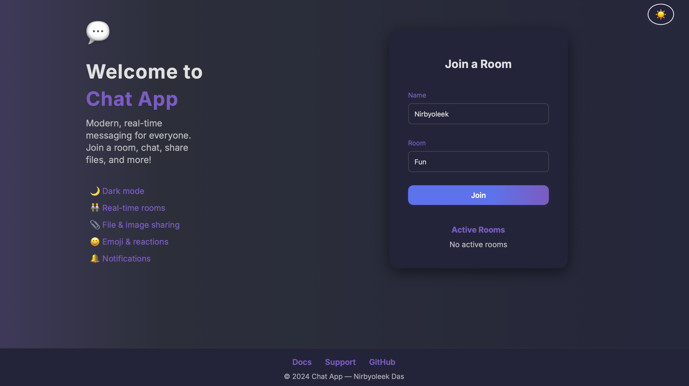

# Chat App 🚀

A modern, real-time group chat application with file sharing, emoji reactions, dark mode, admin controls, and more. Invite your friends and start chatting instantly!

---

## ✨ Features
- **Real-time messaging** with Socket.io
- **Rooms**: Create or join any room instantly
- **File & image sharing**
- **Emoji support** and reactions
- **Dark mode** toggle
- **Online/offline status**
- **Admin controls**: Kick, ban, clear chat
- **Message editing & deletion** (client-side)
- **Share room link** for easy invites
- **Mobile responsive** and PWA-ready

---

## 🚦 Live Demo
> [https://chat-app-ymju.onrender.com](https://chat-app-ymju.onrender.com)

---

## 🖥️ Screenshots


---

## 🛠️ Tech Stack
- **Frontend**: HTML, CSS, Vanilla JS, Mustache.js
- **Backend**: Node.js, Express, Socket.io
- **Styling**: Modern CSS, Google Fonts, Responsive Design

---

## 🚀 Getting Started

### 1. Clone the repo
```bash
git clone https://github.com/yourusername/Chat-App.git
cd Chat-App
```

### 2. Install dependencies
```bash
npm install
```

### 3. Run the app locally
```bash
node src/index.js
```
Visit [http://localhost:3000](http://localhost:3000) in your browser.

---

## 📦 Project Structure
```
Chat-App/
  public/         # Frontend (HTML, CSS, JS, images)
  src/            # Backend (Node.js, Express, Socket.io)
  package.json    # Project metadata and scripts
```

---

## 🙏 Credits
- UI illustrations: [unDraw.co](https://undraw.co/)
- Emoji rendering: [Twemoji](https://twemoji.twitter.com/)
- Built by Nirbyoleek Das

---

## 📄 License
MIT
